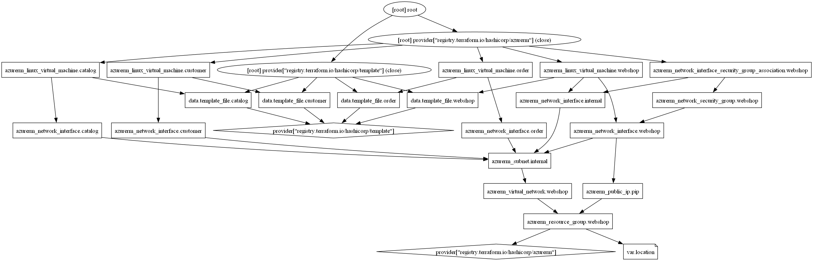
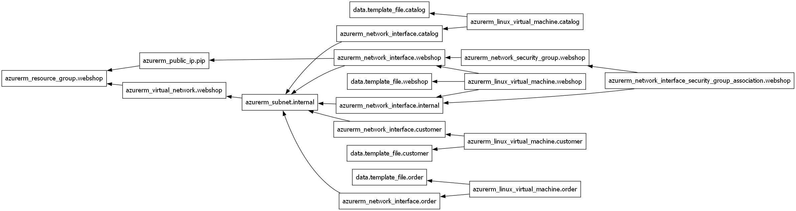

## Übung 03-3-visualisierung: Visualisierung von Azure und Terraform Ressourcen

Für die Übungen wird [VSCode](https://code.visualstudio.com/), benötigt. Diese Anleitung steht in der Datei [README.md](README.md). Die Eingaben finden im integrierten Terminalfenster statt, in dem Verzeichnis wo sich auch die Übungendateien befinden.

Ausserdem muss das [Azure CLI](https://docs.microsoft.com/en-us/cli/azure/) und [Graphviz](https://graphviz.org/download/) installiert sein.

### Einleitung

Während Terraform eine leistungsstarke Lösung für die Bereitstellung und Verwaltung von Infrastruktur bietet, kann die Komplexität der erstellten Umgebungen mit der Anzahl und Vielfalt der Ressourcen schnell zunehmen. In solchen Szenarien wird die Visualisierung der Terraform-Ressourcen zu einem unverzichtbaren Werkzeug, um die Struktur und Beziehungen zwischen den verschiedenen Komponenten klar zu verstehen.

* Übersichtliche Darstellung: Eine grafische Darstellung der Infrastruktur ermöglicht es den Teams, die Interaktionen zwischen den Ressourcen zu visualisieren und zu verstehen, was zu einer verbesserten Kommunikation und Zusammenarbeit führt.
* Fehlererkennung und Debugging: Durch die Visualisierung können potenzielle Fehler oder Inkonsistenzen in der Infrastrukturkonfiguration leichter identifiziert und behoben werden.
* Planung und Optimierung: Die Visualisierung ermöglicht es den Teams, die Infrastrukturarchitektur zu analysieren und potenzielle Optimierungen oder Skalierungsmöglichkeiten zu erkennen.

### Übung

**Visualisierung Zusammenhänge**

- - -

Installiert [Graphviz](https://graphviz.org/download/), z.B. durch Downloaden und Entpacken der ZIP-Datei ins C:\bin. 
Erweitert die PATH-Variable um "C:\bin\Graphviz\bin".

Erstellt ein Diagramm welche Ressourcen mit welchen zusammenhängen. 

    terraform graph -type=plan | dot -Tpng > webshop-plan.png

**Visualisierung Cycle**

- - -

Dann ein Diagramm, in welcher Reihenfolge (Zyklus) die Ressourcen erstellt werden.

    terraform graph -draw-cycles | dot -Tpng > webshop-cycles.png

### Links

* [Dokumentation](https://developer.hashicorp.com/terraform/cli/commands/graph)

