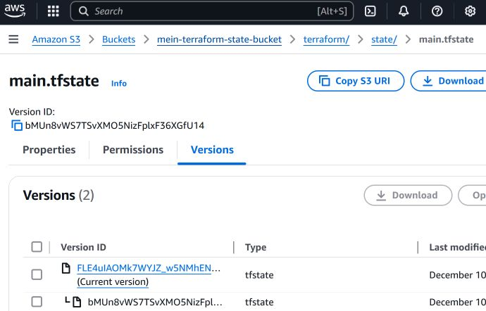

## Übung 06-1: Remote State Storage

- - -

Für die Übungen wird [VSCode](https://code.visualstudio.com/), benötigt. Diese Anleitung steht in der Datei [README.md](README.md). Die Eingaben finden im integrierten Terminalfenster statt, in dem Verzeichnis wo sich auch die Übungendateien befinden.

### Übung

**ACHTUNG**: Funktioniert nicht mit AWS Academy.

Zuerst muss das S3 Bucket angelegt werden.

    cd 01-state
    terraform init
    terraform apply -auto-approve
    
Anschliessend können die weiteren Ressourcen angelegt werden.

    cd ../02-state
    terraform init
    terraform apply -auto-approve 
    
Dank der `backend.tf` Datei wird die State Datei nicht mehr lokal sondern, Versioniert in der AWS Cloud als S3 Bucket gespeichert.    

    terraform {
      backend "s3" {
        bucket  = "mein-terraform-state-bucket"  # Name des S3-Buckets
        key     = "terraform/state/main.tfstate" # Pfad/Name der State-Datei im Bucket
        region  = "us-east-1"                    # Region, in der der S3-Bucket erstellt wurde
        encrypt = true                           # Verschlüsselung des State aktivieren
      }
    }